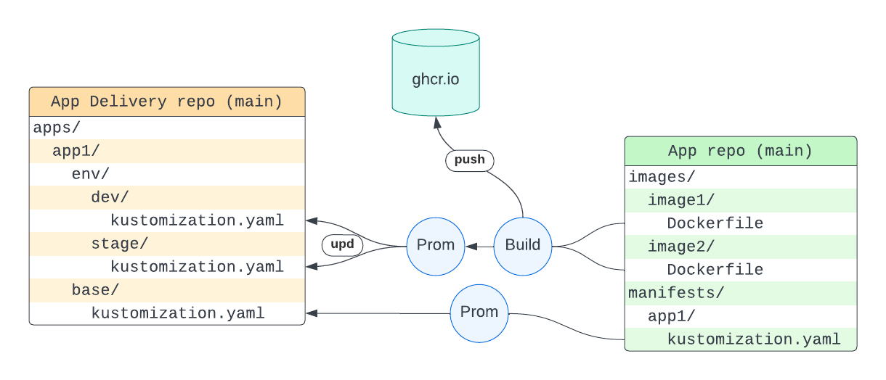

# Example application using Argo Workflows and Argo Events

## Concept
This repository is based on a concept that any application has two parts:
* Some docker images
* Connections between these images

For example, here are diagrams of two different applications using the same set of docker images:


We keep images in the `/images` folder, and connection between them in the `/manifests` folder.


## Continious Integration

There are two possibe ways to trigger the CI pipelines:
* Update images
* Update manifests



### Update images
When change in `/images` folder is detected, GitHub triggers "Build and Promote" Action, which does build and promote for the each subfolder.

#### Build
* Run unit tests
* Build image
* Tag image as `ghcr.io/<repository_owner>/<subfolder_name>:`
  * `sha-<short-sha>` if triggered event is push in branch
  * `x.x.x` if triggered event is tag `vx.x.x`
* Push image to ghcr.io

#### Promote
* Checkout into main branch of [nikita-akuity/demo-workflow-delivery](https://github.com/nikita-akuity/demo-workflow-delivery) repository
* Run `kustomize set image <subfolder-name>=<image-url>:<tag>`
  * in `apps/<subfolder-name>/env/dev` if triggered event is push in branch
  * in `apps/<subfolder-name>/env/stage` if triggered event is tag `vx.x.x`
* Push changes to [nikita-akuity/demo-workflow-delivery](https://github.com/nikita-akuity/demo-workflow-delivery) repository

The promote part can be removed and replaced with [Argo CD Image Updater](https://argocd-image-updater.readthedocs.io/en/stable/)

### Change a manifest
When change in `/manifests` folder is detected, GitHub triggers "Update Kustomize Base" Action which does promotion for the each subfolder.

#### Promote
* Test manifests by running `kustomize build <subfolder-name>`
* Checkout into main branch of [nikita-akuity/demo-workflow-delivery](https://github.com/nikita-akuity/demo-workflow-delivery) repository
* Update `resources` list in the `apps/<subfolder-name>/env/base/kustomization.yaml`, setting the first element of the list into `"https://github.com/<repository>//manifests/<subfolder-name>/?ref=<sha>"`
* Push changes to [nikita-akuity/demo-workflow-delivery](https://github.com/nikita-akuity/demo-workflow-delivery) repository

# Images in this repository

All images are simple python based scripts:
* [greetings](images/greetings)  
  Take a string argument `--names` (e.g.`"name1,name2"`) and create a file  
  ```
  hello name1
  hello name2
  ```
* [replace-text](images/replace-text)  
  Take an input text file, replace `hello` to `goodbye` and save result into different file, e.g.  
  ```
  goodbye name1
  goodbye name2
  ```
* [count](images/count)  
  Take an input file, count number of string occurances there and print the result number in stdout

# Applications in this repository

Please check corresponding folders for the detailed description of each application:
* [single workflow](manifests/single-workflow/)
* [many workflows](manifests/many-workflows/)
