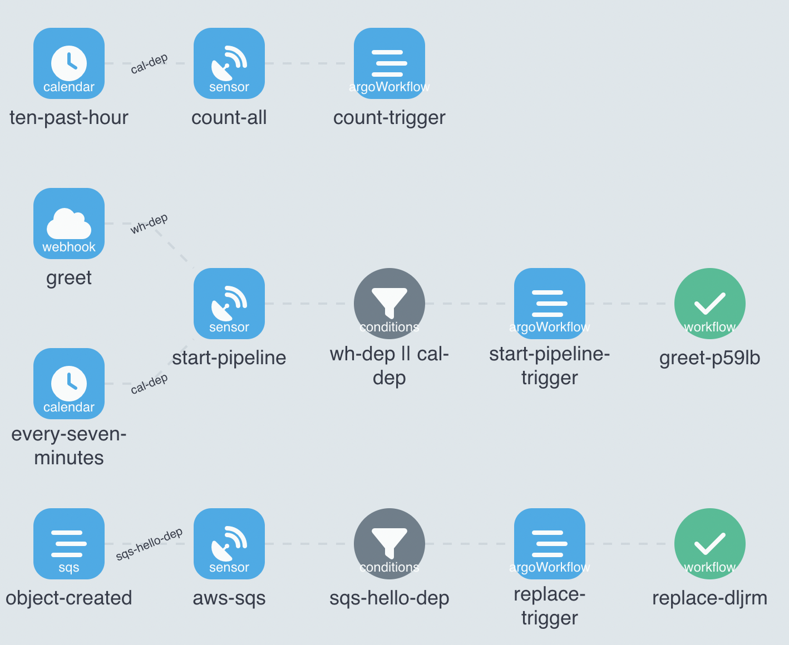
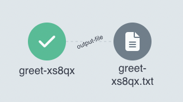
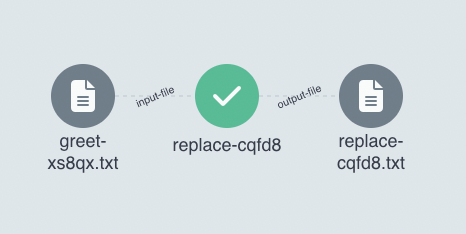
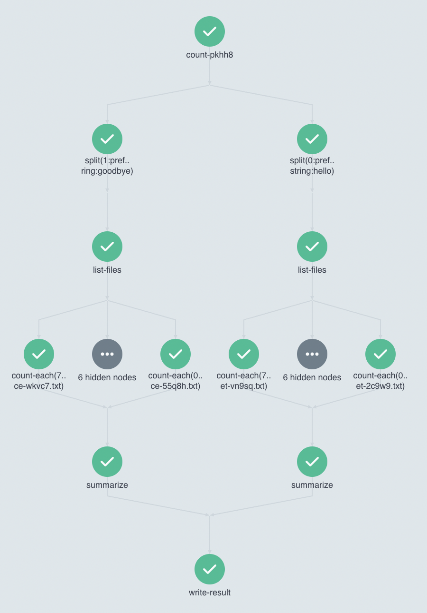

# Docker containers combined into a pipeline of many workflows

## Events

* Start-pipeline workflow is is triggered either by webhook or a calendar event
* Replace workflow is triggered by an sqs event, when output file from the previous step appears in s3 bucket
* Count workflow is triggered hourly by a calendar event


### Webhook
Payload shoud be a json object with "names" string field.

Example:
```
curl -d '{"names":"Hong,Jesse"}' -H "Content-Type: application/json" -X POST http://<url>:12000/greet
```

### SQS
* EventSource filters out all events where `eventName` is not `ObjectCreated` and `eventSource` is not `aws:s3`
* Sensor passes two parameters into workflow trigger: `bucket` and `key` with coordinates of the recently created file

### Calendar
Calendar emits two events.
* every 7 minutes:  
  sensor transforms the `metadata.names` field with lua script to insert a randomly generated string  
  Example: 
  ```
  k,l,m,n,0,p
  ```
* by `10 * * * *` schedule:  
  sensor transforms the `metadata.targetTime` field, inserting a `YYYY-mm-DD HH:MM:SS` formatted time of 1 hour prior to the event  
  Example:
  ```
  {
    "eventTime": "2022-10-07 00:10:00.000244549 +0000 UTC m=+114.646981673",
    "metadata": {
        "targetTime": "2022-10-06 23:10:00"
    }
  }
  ```

## Workflows

### Greet
* Takes a string `names` as an input parameter
* Creates a single `{{pod.name}}.txt` file in `hellos/YYYY-mm-DD/HH/` folder of configured s3 bucket with `hello <name>` content  
  

### Replace
* Takes a `bucket` and `key` strings as input parameters
* Replaces `hello` to `goodbye` and saves an output file with `{{pod.name}}.txt` in `goodbyes/YYYY-mm-DD/HH/` folder of configured s3 bucket  
  

### Count
* Takes a string `timestamp` as an input parameter. Expected format is `YYYY-mm-DD HH:MM:SS`
* For `hello` and `goodbye` directories
  * List all files in the `<dir>/YYYY-mm-DD/HH/` directory of the configured s3 bucket
  * Summarize all entrances of hellos and goodbyes in each file
* Combine the result and write it to database
  


# Directory structure

* All WorkflowTemplates stored in the [/workflows](workflows) folder
* All EventSources and Sensors stored in the [/events](events) folder
* Example configmaps and secrets stored in the [/generators](generators) and some additional folders

The actual environment configuration stored in [nikita-akuity/demo-workflow-delivery//apps/many-workflows](https://github.com/nikita-akuity/demo-workflow-delivery/tree/main/apps/many-workflows)
