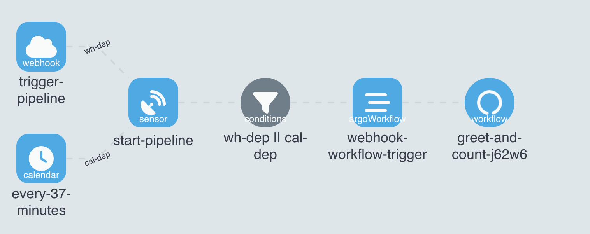
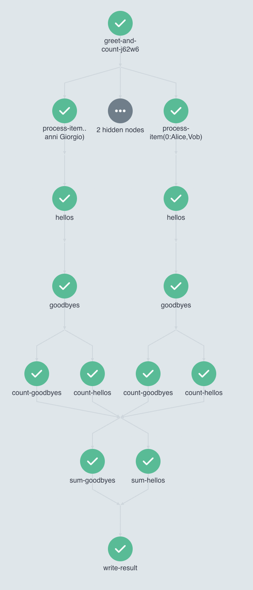

# Docker containers combined into a single DAG


## Events

This workflow is triggered either by webhook or a calendar event:


### Webhook 
Payload shoud be a list of strings.

Example:
```
curl -d '["Alice,Vob","Bob","Chris","Giovanni Giorgio"]' -H "Content-Type: application/json" -X POST http://<url>/greet-and-count
```
### Calendar
Every 37 minutes calendar emits an event and sensor transforms the event metadata with lua script, generating a random json list of strings.

Example of the random input-payload list:
```
["e,f,g,h,i,j,k,l,m,n","c,d,e,f,g,h,i,j,k,l,m,n,0,p","","i,j,k,l,m,n,0,p","f,g,h,i,j,k,l","a,b,c,d,e,f,g,h,i,j,k,l,m,n,0","i,j,k","f,g,h"]
```

## Workflow
The workflow:
* creates text files for each elements of the input payload with `hello <name>` content and puts the output file to s3 bucket
* uses the file from previous step and replaces `hello` to `goodbye`
* counts the number of hellos and goodbyes in each file
* summarize all the hellos and goodbyes and writes the result to a mysql database

This is a diagram for a workflow triggered by a webhook:


# Directory structure

* All WorkflowTemplates stored in the [/workflows](workflows) folder
* All EventSources and Sensors stored in the [/events](events) folder
* Example configmaps and secrets stored in the [/generators](generators) and some additional folders

The actual environment configuration stored in [nikita-akuity/demo-workflow-delivery//apps/single-workflow](https://github.com/nikita-akuity/demo-workflow-delivery/tree/main/apps/single-workflow)
